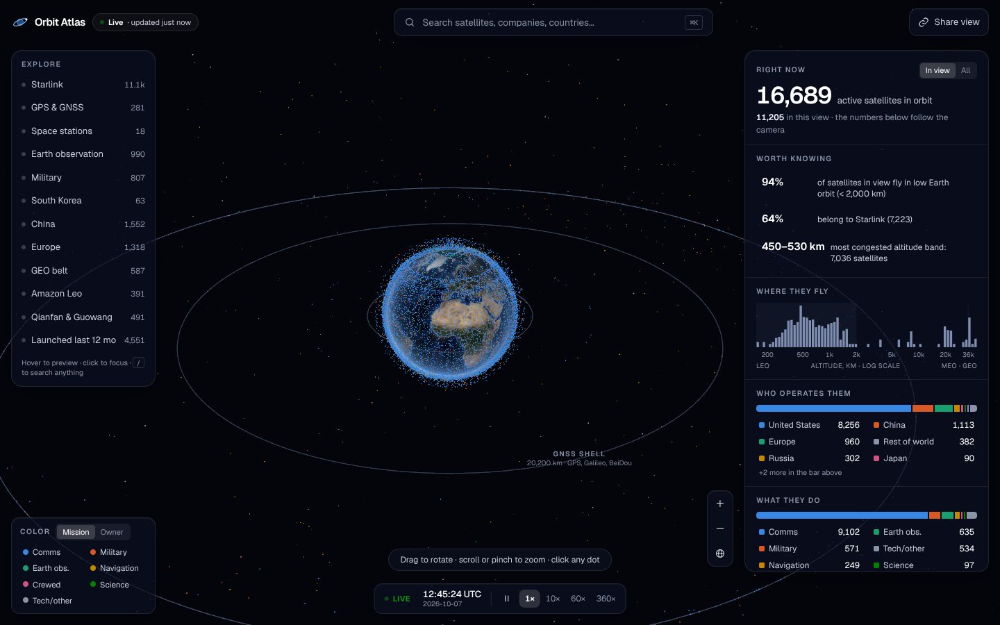
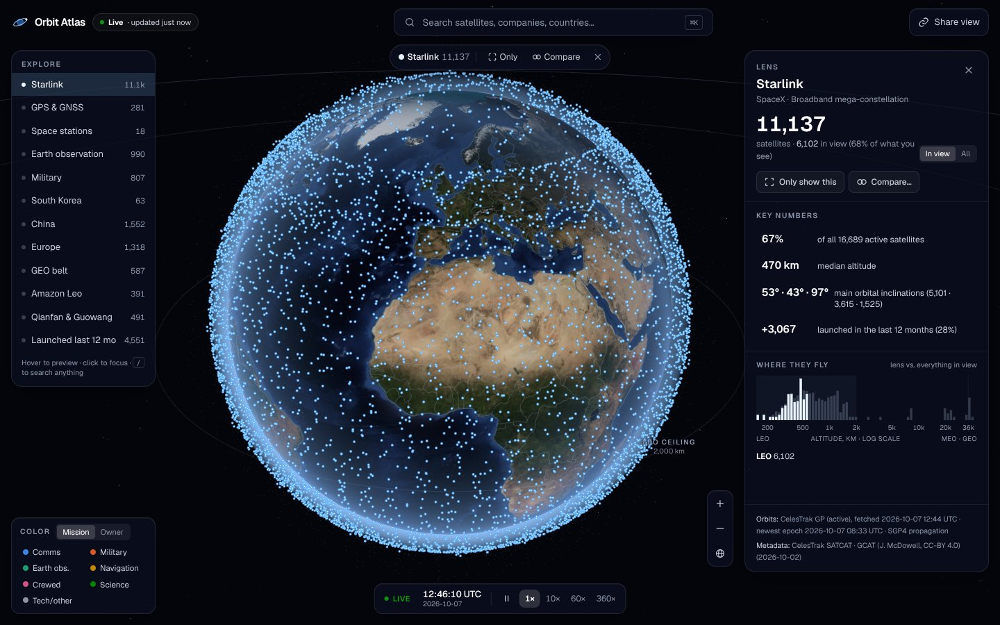
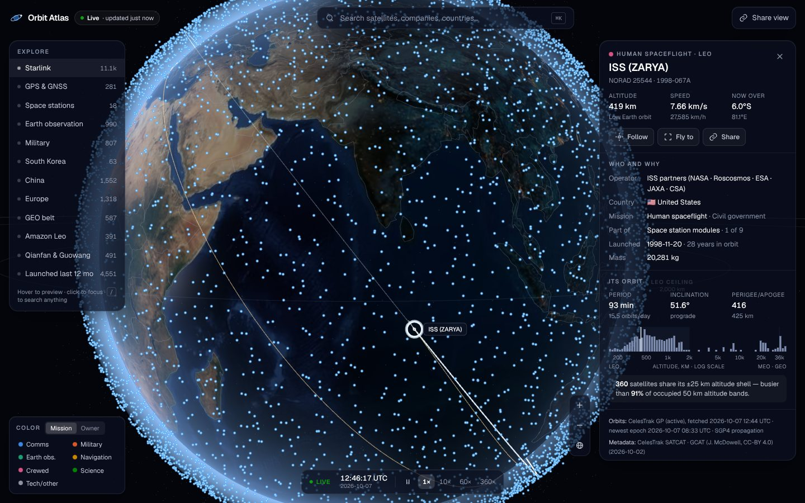

# Orbit Atlas

**Orbit Atlas is an interactive 3D explorer for every active satellite.** It is built so that someone who has never used a satellite tracker can answer these questions within a few seconds:

- How many satellites are up there right now, and how many are over this side of the Earth?
- Where do they fly? (LEO vs. MEO vs. GEO, and the busiest altitude bands)
- Who operates them? (United States, China, Europe, Russia, Japan, India, South Korea…)
- What do they do? (Starlink-style broadband, GPS, Earth observation, military…)

The UX is the point, not the volume of data. Everything you do (click an Explore preset, search, click a stat bar, brush the altitude histogram) produces one **lens**: a query that the globe, the statistics and the URL all follow. Stats are computed **only for what is in view**, so rotating the globe or zooming in changes the numbers.

> Product research and the reasoning behind the interaction model: [`docs/RESEARCH.md`](docs/RESEARCH.md)



| Starlink lens | Selected satellite (ISS) |
|---|---|
|  |  |

---

## Features

| | |
|---|---|
| **3D globe** | Earth with the real day/night terminator and city lights, an atmosphere rim, and LEO / GNSS / GEO reference rings. All ~17k satellites are drawn in a single GPU draw call |
| **Real motion** | Latest public GP elements (OMM) from CelesTrak, propagated with SGP4 in a Web Worker. The GPU interpolates positions between snapshots |
| **Explore** | One-click presets: Starlink, GPS & GNSS, Space stations, Earth observation, Military, South Korea, China, Europe, GEO belt, Amazon Leo, Qianfan & Guowang, Launched last 12 mo. Hovering a preset previews it on the globe |
| **Command bar** (`/` or `⌘K`) | Searches satellites (name, NORAD number, COSPAR ID, nicknames like "ISS"), operators, countries, constellations, missions and orbits. Arrow keys preview each result on the globe. Korean queries work too: 스타링크, 한국, 군사, 정지궤도… |
| **Lens actions** | *Only show this*, *Compare…* (A = blue vs. B = orange, with a side-by-side table), and refining by clicking any bar |
| **Altitude histogram** | Log-scaled altitude axis that shows the 550 km Starlink shells, the 20,200 km GNSS shell and the GEO spike. **Drag across it to filter by altitude band** |
| **Satellite card** | Operator, country, mission, sector, live altitude/speed/position, period, inclination, perigee/apogee, launch date and age, mass, and shell congestion ("busier than 87% of occupied orbits") |
| **Selection** | Bright orbit trail (solid ahead, faint behind), pulsing marker, nadir line and ground track. *Follow* locks the camera to the satellite |
| **Small-lens orbits** | Lenses with ≤ 320 satellites (GPS, GNSS, Korea…) draw every orbit, which makes the orbital planes visible |
| **Intelligence layer** | Short number-first facts, each one clickable: "94% of satellites in view fly in LEO", "65% belong to Starlink", "450–530 km is the most congested band", "+3,067 Starlink launched in the last 12 months" |
| **Time** | Live clock, 10× / 60× / 360× time warp, pause, and a *Go live* button to return to real time |
| **Shareable state** | Lens, compare, selection, follow, color mode, time warp and camera are kept in the URL, e.g. `/?cs=starlink&only=1`, `/?bloc=US&vs.bloc=CN`, `/?sat=25544&follow=1` |
| **Mobile** | Explore chips, full-screen search, and a bottom sheet (peek / half / full) for details. The globe lifts above the sheet |
| **Resilience** | Live → warm instance cache → ISR cache → browser IndexedDB copy → static snapshot. The app always renders, and it says which of these it is showing |

Keyboard shortcuts: `/` search · `Esc` back out one level · `F` follow · `H` reset view · `Space` pause · `L` go live.

---

## Quick start

```bash
npm install
npm run dev          # http://localhost:3000
```

Other scripts:

```bash
npm run build        # production build (also copies the snapshot to /public)
npm start            # serve the production build
npm test             # unit tests (vitest)
npm run lint         # eslint
npm run typecheck    # tsc --noEmit
npm run data:refresh # rebuild data/catalog-snapshot.json from CelesTrak + GCAT
```

Requires Node ≥ 20.9.

> Behind a corporate proxy, Node's `fetch` ignores `HTTPS_PROXY` unless you set `NODE_USE_ENV_PROXY=1` (Node ≥ 22.21). For offline work, set `ORBIT_ATLAS_OFFLINE=1`.

---

## Data sources

| Data | Source | Used for | Refresh |
|---|---|---|---|
| Orbital elements (GP / OMM mean elements, `GROUP=active`) | [CelesTrak](https://celestrak.org/NORAD/elements/) | Positions (SGP4), altitude, period, regime | Live, ISR-cached for 2 h |
| SATCAT (`GROUP=active`) | [CelesTrak SATCAT](https://celestrak.org/satcat/) | Owner code and launch date for satellites newer than the snapshot | Live, optional |
| GCAT satellite & payload catalogs, organisations | [GCAT, Jonathan McDowell](https://planet4589.org/space/gcat/) (CC-BY 4.0) | Operator, mission category, civil/commercial/military class, mass | Snapshot (`npm run data:refresh`) |
| Earth imagery | NASA Blue Marble & Black Marble (public domain), via the `three-globe` example assets | Day and night textures | Static |
| Borders | Natural Earth 1:110m via [`world-atlas`](https://github.com/topojson/world-atlas) | Country outlines | Static |

Notes:

- **Why OMM/CSV rather than TLE:** NORAD catalog numbers have passed 99,999, and the TLE format cannot represent them. Orbit Atlas uses CelesTrak's CSV OMM format end to end.
- **Classification** (`src/lib/data/classify.ts`) merges GCAT categories with name rules for constellations (Starlink, OneWeb, Kuiper, Qianfan, Guowang, GPS, Galileo, BeiDou, GLONASS…). Defense-class satellites count as *Military* unless their job is navigation. GPS, BeiDou and GLONASS stay under *Navigation*.
- **Country** is the state of registry or ownership (GCAT `State`, falling back to the CelesTrak owner code). *Europe* groups European states with ESA, the EU and EUMETSAT, and includes the UK (OneWeb).
- **Etiquette:** CelesTrak asks clients not to download the same data more than once every 2 hours. The ISR interval is set to exactly that, and the fallbacks absorb rate limits (HTTP 403).

The UI always shows where the current data came from (*Live / Cached / Snapshot* pill, plus a provenance footer with fetch time and newest element epoch).

---

## Environment variables

Every variable is optional. See [`.env.example`](.env.example).

| Variable | Default | Purpose |
|---|---|---|
| `CELESTRAK_BASE_URL` | `https://celestrak.org` | Point at a mirror or caching proxy |
| `CATALOG_CACHE_SECONDS` | `7200` | Warm-instance cache lifetime for the live catalog |
| `ORBIT_ATLAS_OFFLINE` | `0` | `1` = never call upstream; always serve the bundled snapshot |
| `ORBIT_ATLAS_CONTACT` | repo URL | Contact string in the upstream `User-Agent` |
| `NEXT_PUBLIC_SITE_URL` | Vercel production URL | Base URL for Open Graph metadata |

---

## Deploying to Vercel

The repository needs no extra configuration on Vercel:

1. **Import** the repo at <https://vercel.com/new>. The Next.js framework preset is detected (`vercel.json` pins `npm ci` / `npm run build`).
2. (Optional) add any environment variables from the table above.
3. **Deploy.**

What happens on Vercel:

- `npm run build` runs `prebuild`, which copies `data/catalog-snapshot.json` to `public/data/` as a static client fallback.
- `/api/catalog` is an **ISR route handler** (`dynamic = 'force-static'`, `revalidate = 7200`). It is prerendered at build time. If CelesTrak is unreachable from the build machine, the build still succeeds using the bundled snapshot. After that it regenerates in the background at most every 2 hours.
- If a **background** regeneration fails (outage, rate limit), the handler throws on purpose, so Vercel keeps serving the last successful response instead of downgrading to the snapshot.
- The payload is about 2.9 MB of JSON (about 0.75 MB compressed), well under the 4.5 MB function response limit.
- Textures and borders are cached for a week (`stale-while-revalidate` for a month).

Keeping the snapshot fresh is optional, because live data covers normal operation. To refresh it, run `npm run data:refresh` and commit `data/catalog-snapshot.json`, or schedule that in CI.

---

## Architecture

```
src/
├─ app/
│  ├─ api/catalog/route.ts      ISR route: live CelesTrak → enriched columnar payload
│  ├─ layout.tsx, page.tsx      shell + metadata
├─ lib/
│  ├─ data/                     DATA LAYER (framework-free, server + client)
│  │  ├─ celestrak.ts           fetch + CSV/OMM parsing, rate-limit detection
│  │  ├─ classify.ts            name rules, GCAT/SATCAT code mappings
│  │  ├─ catalog-builder.ts     columnar payload encode/decode, metadata merge
│  │  ├─ server-catalog.ts      live → warm cache → snapshot (server only)
│  │  ├─ taxonomy.ts            missions, owner blocs, regimes, countries, colors
│  │  └─ orbit.ts               derived orbit quantities and regime classification
│  ├─ catalog/                  client decode into typed arrays; load with fallbacks
│  ├─ query/                    QUERY LAYER: lens, search, stats, insights, URL state
│  └─ sim/                      SIMULATION: clock, frames (GMST/sun), SGP4 worker,
│                               propagation manager, single-satellite precise state
├─ store/atlas.ts               zustand store: lens / selection / compare / view
└─ components/
   ├─ scene/                    VISUALIZATION (react-three-fiber)
   │  Earth, Borders, Stars, RegimeRings, SatellitePoints (1 draw call),
   │  Selection, GroundTrack, LensOrbits, CameraRig (fly-to, follow, picking, in-view)
   └─ ui/                       UI: TopBar, CommandBar, ExplorePanel, ContextPanel
                                (Overview / Lens / Satellite / Compare), charts, time
```

### Why Three.js + react-three-fiber (not CesiumJS)

CesiumJS is excellent for geodesy, but it is heavy, needs asset copying and an ion token for default imagery, gives limited control over the look, and slows down when it updates tens of thousands of moving primitives from JS. Orbit Atlas needs custom shaders for focus/ghost styling, bloom only on selected things, and one draw call for everything. Three.js through react-three-fiber gives that in a small bundle, alongside React state. Full comparison: `docs/RESEARCH.md`.

### Rendering pipeline (designed for 10k–100k objects)

1. **Worker** (`propagator.worker.ts`): one `SatRec` per satellite (`json2satrec` on OMM). Each request propagates *every* satellite to time *t* (about 10–20 ms for 17k) and returns a transferable `Float32Array`.
2. **Propagation manager**: keeps snapshots A (t₀) and B (t₁) and prefetches C. A window covers 1 s of real time but never more than 60 s of sim time, so even at 360× the linear blend stays within a few km of the true arc.
3. **Vertex shader**: `mix(A, B, uMix)` every frame, with color by mission or owner from uniform palettes and size/alpha from a 1-byte style attribute (hidden / ghost / base / focus / compare A / compare B). Changing a lens rewrites only this style buffer.
4. **Picking & in-view**: one CPU pass over interpolated positions (about 1 ms), with a frustum test and an Earth-occlusion ray test. The in-view index list drives every statistic at about 3 Hz.
5. **Adaptive quality**: `PerformanceMonitor` drops DPR and disables bloom if the frame rate declines. The only full-screen effect is bloom.

### Extending it

The layers are separated so new features plug in without touching the core:

| Future feature | Where it goes |
|---|---|
| Density / congestion heatmap | `query/stats.ts` already bins altitudes; add a shell-density texture layer in `scene/` fed by the same in-view indices |
| Conjunctions / collision risk | New worker message type next to `propagate` (screening on the same SatRecs); results become a lens (`ids`) plus a scene layer |
| Ground stations | Static dataset in `lib/data/`, rendered in the Earth-fixed group (the same frame as `GroundTrack`) |
| Sat↔ground / sat↔sat links | Line layer that reads `runtime.propagation.position(i)`; link selection is a lens |
| Space weather | API route (NOAA SWPC) and an overlay in the scene, plus an insight in `query/insights.ts` |
| Launch events | API route + `launchedWithinDays` lens field (already exists) + timeline UI |
| Telemetry / anomalies | Per-satellite metadata keyed by NORAD id; shown in `SatelliteCard`, filtered by lens |
| Autonomous ops simulation | The sim clock supports warp and pause; add maneuver deltas to the worker's SatRecs |

---

## Testing

- `npm test` covers: CSV/OMM parsing (including 6-digit NORAD ids and CelesTrak throttle notices), classification rules, regime derivation, payload round-trip, lens algebra, URL state round-trip, search ranking (including Korean aliases), stats/insights, frame math (GMST, sun position, lat/lon round-trip), and the full server fallback chain (live → warm cache → snapshot, plus *throw on runtime revalidation*).
- The build-time live path was checked with `CELESTRAK_BASE_URL` pointed at a local mock: one GP and one SATCAT request at build, then served from the ISR cache (`x-nextjs-cache: HIT`, `source: live`).
- UX was checked by driving the real app in headless Chromium (desktop 1440×900 and mobile 390×844) through these flows: first view, Explore preview → lens, search "ISS" → select → follow, Starlink lens → *Compare* → China, altitude brush, GNSS *Only* with orbits, Korean search on mobile.

---

## Credits & licenses

Orbital data © CelesTrak (T.S. Kelso). Satellite metadata from GCAT by Jonathan McDowell (CC-BY 4.0). Earth imagery: NASA Visible Earth (public domain). Borders: Natural Earth (public domain). SGP4: [satellite.js](https://github.com/shashwatak/satellite-js).
