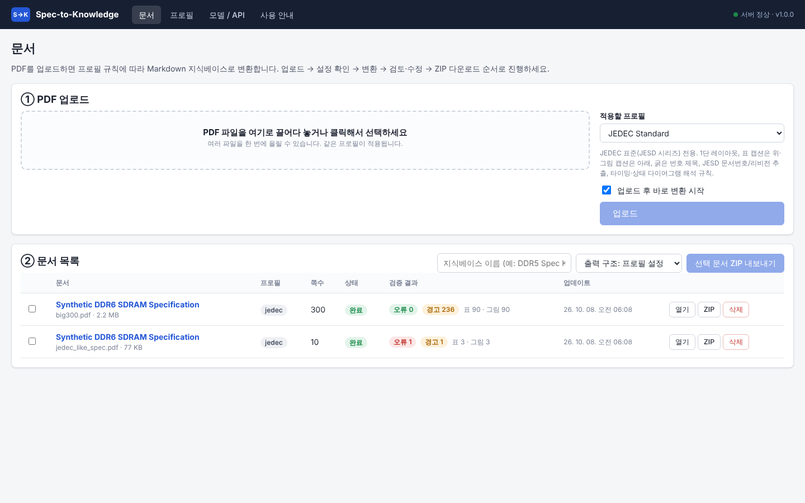
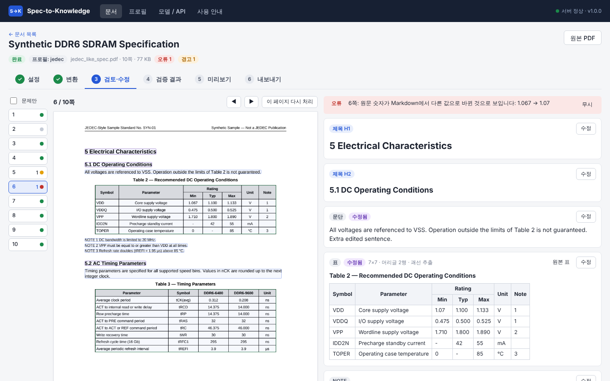
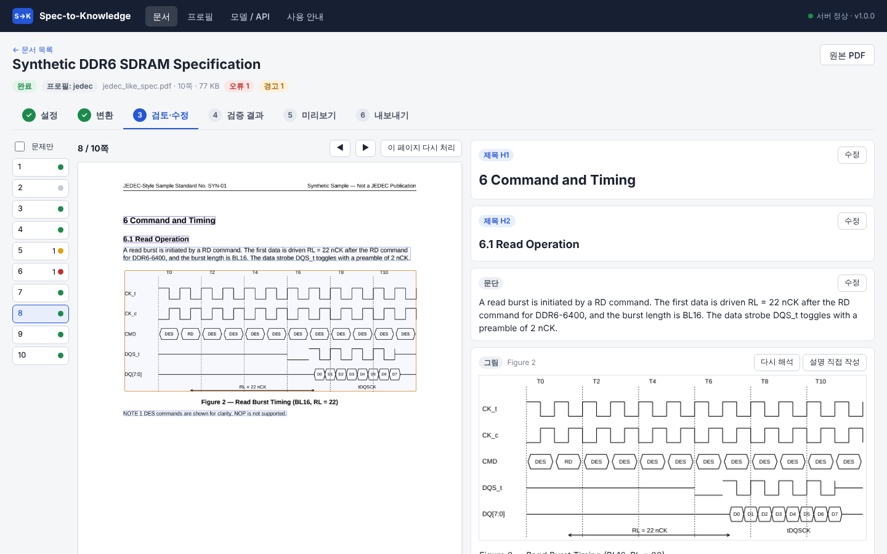
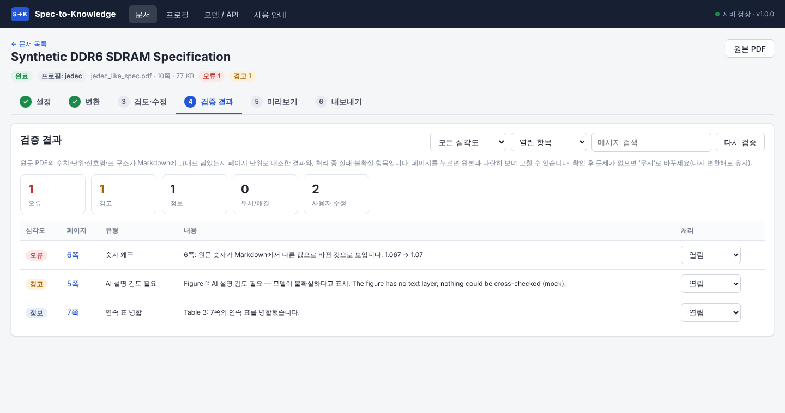
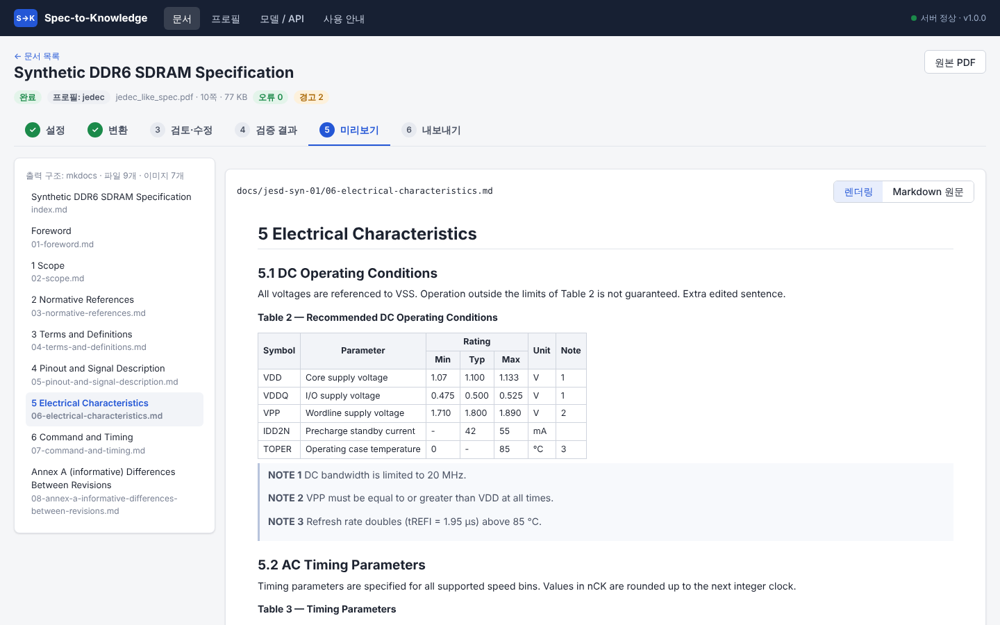
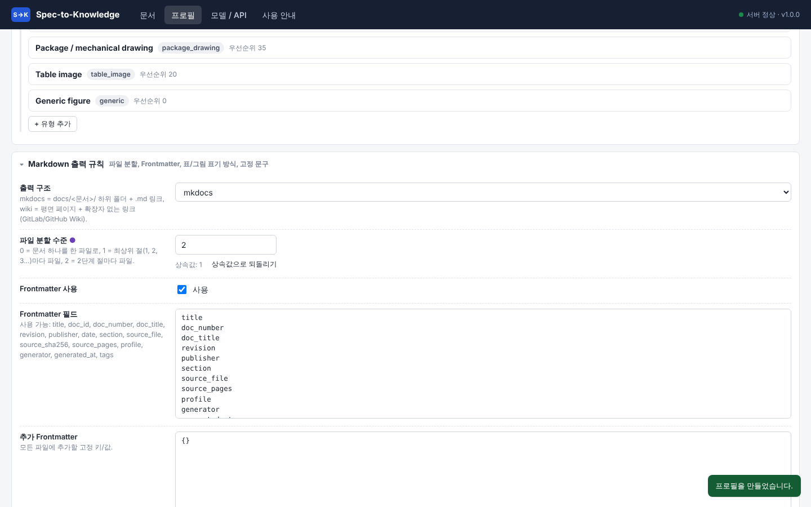

# 사용자 가이드 (비개발자용)

브라우저로 `http://<서버>:8765`에 접속합니다. 위쪽 메뉴는 **문서 · 프로필 · 모델 / API · 사용 안내** 네 가지입니다. 화면 안에도 같은 안내가 ‘사용 안내’ 메뉴로 들어 있습니다.

## 1. 문서 올리기

1. PDF를 점선 상자에 끌어다 놓습니다(여러 개 가능).
2. **적용할 프로필**을 고릅니다.
   - JEDEC 표준(JESD…) → **JEDEC Standard**
   - 고객 요구사항 문서 → **Customer Spec**
   - 그 밖의 데이터시트·보고서 → **General**
   - 팀에서 만든 프로필이 있으면 그것을 고릅니다.
3. ‘업로드 후 바로 변환 시작’이 켜져 있으면 업로드와 동시에 변환이 시작됩니다. 목록에서 진행률(%)을 볼 수 있습니다.
4. 상태가 **완료**가 되면 검증 결과(오류·경고 수)가 표시됩니다. 문서 이름을 누르면 작업 화면으로 갑니다.

여러 문서를 체크한 뒤 **선택 문서 ZIP 내보내기**를 누르면 문서들을 하나의 지식베이스로 묶어 받을 수 있습니다. 지식베이스 이름과 출력 구조도 고를 수 있습니다.

## 2. 문서 작업 화면 (6단계)

### ① 설정
- 프로필을 바꾸거나, **이 문서에만** 적용할 옵션을 정합니다. 처리할 페이지(예: `1-20`), AI 그림 설명 사용 여부, Vision 모델, 설명 언어, 파일 분할(절 단위), 표 형식, 출력 구조(MkDocs / Wiki), AI 설명 표시 방식을 고를 수 있습니다.
- 처음엔 모두 ‘프로필 기본값’입니다. 바꾼 항목만 이 문서에 적용됩니다.
- 변환이 끝난 뒤에는 **문서 메타데이터**(제목, 문서 번호, 리비전, 발행 기관, 발행일)를 고칠 수 있습니다. 고친 값은 모든 Markdown 파일의 Frontmatter에 반영됩니다.

### ② 변환
- 진행 단계(머리글 분석 → 페이지 분석 → OCR → 조립 → AI 그림 설명 → 검증 → 저장)와 진행률, 로그가 보입니다. **작업 취소**도 할 수 있습니다.
- 끝나면 페이지·제목·표·그림 수와 오류·경고 수를 요약해 보여 줍니다.
- **부분 재처리**에서는 일부 페이지만 다시 분석하거나, ‘실패한 그림’ 또는 ‘검토 필요 그림’만 한꺼번에 다시 해석할 수 있습니다.

### ③ 검토·수정

- 왼쪽 세로 목록은 페이지입니다. 점 색깔은 초록(정상), 노랑(경고), 빨강(오류), 회색(목차 등 제외)을 뜻하고, 숫자는 문제 개수입니다. ‘문제만’을 체크하면 확인할 페이지만 남습니다. 키보드 ←/→로도 넘길 수 있습니다.
- 가운데는 **원본 페이지**입니다. 테두리는 추출된 블록 영역이고 색은 제목(보라), 표(초록), 그림(주황), 나머지(파랑)입니다. 마우스를 올리면 오른쪽 블록과 서로 강조되고, 누르면 해당 블록으로 이동합니다.
- 오른쪽은 **결과 블록**입니다. 맨 위에 그 페이지의 검증 문제가 나오고, 확인했으면 ‘무시’를 누릅니다.
  - **수정**: 블록의 Markdown을 직접 고칩니다. 저장하면 원문과 즉시 다시 대조합니다. 값을 실수로 지우면 바로 오류로 알려 줍니다. ‘자동 생성값으로 되돌리기’로 원래대로 돌릴 수 있습니다.
  - **표**: ‘원본 표’로 PDF의 표 이미지를 보면서 표 Markdown(GFM 또는 HTML)을 고칠 수 있습니다. 행·열 수가 원본과 달라지면 경고합니다.
  - **그림**: 이미지 유형 변경, **다시 해석**(이 그림에만 적용할 추가 지침 입력 가능), **설명 직접 작성**(‘검토된 설명’으로 표시되고 AI 설명 대신 사용)을 할 수 있습니다.
- **이 페이지 다시 처리**: 프로필을 바꾼 뒤 이 페이지만 다시 분석합니다. 같은 위치의 수정 내용은 유지됩니다.

### ④ 검증 결과

- 심각도(오류·경고·정보), 상태(열림·무시·해결), 검색어로 거를 수 있습니다. 페이지를 누르면 ③ 화면의 해당 페이지로 갑니다.
- 주요 항목:
  - **수치·단위 누락/왜곡**, **숫자 왜곡**: 원문 값이 빠지거나 바뀌었습니다(예: `1.067 → 1.07`, `3.9 µs → 3.9 ms`). 반드시 확인하세요.
  - **신호명 누락**: CK_t, CA[13:0], tRCD 같은 이름이 빠졌습니다.
  - **표 구조**: 행·열 수가 달라졌거나 빈 셀이 지나치게 많습니다.
  - **AI 설명 검토 필요**: 모델이 쓴 값이 원문에서 확인되지 않거나, 모델 스스로 불확실하다고 답했거나, 텍스트가 없는 이미지라 자동 대조를 못 했습니다.
  - **OCR 검토 필요**: 스캔 페이지라 OCR로 읽은 텍스트입니다.
  - **괘선 없는 표**, **그림 영역 추정**: 자동 추출이 덜 확실한 항목입니다.
- 문제가 없다고 확인한 항목은 ‘무시’로 바꿉니다. 다시 변환해도 그 상태가 유지됩니다.

### ⑤ 미리보기

- 왼쪽은 생성될 Markdown 파일 목록입니다(문서 정보 `index.md`와 절 파일).
- ‘렌더링’은 MkDocs와 같은 엔진으로 그린 화면이고, ‘Markdown 원문’은 실제 파일 내용입니다. 본문 링크를 누르면 다른 파일로 이동합니다.

### ⑥ 내보내기
- 출력 구조를 고른 뒤 **ZIP 다운로드**를 누릅니다. ZIP에는 Markdown, 이미지, 출처 매핑(`source_map.json`), Canonical JSON, 적용한 프로필, 검증 보고서가 들어 있습니다.
- MkDocs 구조라면 ZIP을 풀고 `mkdocs serve`로 바로 볼 수 있습니다.

## 3. 프로필 만들기·고치기

1. **프로필** 메뉴에서 기준 프로필 옆의 **상속**을 누릅니다(권장). 상속한 프로필에는 바꾼 항목만 저장되므로, 기본 프로필이 개선되면 그 내용이 자동으로 따라옵니다.
   - 복제: 기준 프로필의 변경 항목을 그대로 복사합니다.
   - 독립 사본: 현재 최종 설정 전체를 복사하고 부모를 두지 않습니다.
2. 편집 화면의 네 영역:
   - **파싱 규칙**: 머리글/바닥글, 목차, 제목 번호 패턴, 문단, 표, 그림, 스캔 페이지, 메타데이터 패턴
   - **AI 그림 해석**: Vision 모델, 설명 언어, 동시 호출 수, 시스템 프롬프트, 공통 지침, **이미지 유형별 해석 규칙**(캡션·내부 텍스트 정규식, 우선순위, 지침, 출력 항목)
   - **Markdown 출력 규칙**: 출력 구조, 파일 분할, Frontmatter 항목, 표 형식, AI 설명 표시 방식, 출처 표기, 고정 문구(한국어 라벨로 바꾸기 등)
   - **검증 기준**: 단위 목록, 신호명 패턴, 보존 식별자 패턴(예: `REQ-[A-Z]+-\d+`), 텍스트 보존율 기준
3. 부모와 다른 항목에는 ● 표시와 ‘상속값으로 되돌리기’ 버튼이 붙습니다.
4. **저장**합니다. 정규식에 오류가 있으면 저장하지 않고 위치를 알려 줍니다. 저장한 설정은 이후 변환(또는 ‘다시 변환’)부터 적용됩니다.
5. 프로필은 JSON으로 **내보내기/가져오기**해서 다른 서버나 팀과 공유할 수 있습니다.

## 4. 모델 / API 등록

1. **Provider 추가**를 누르고 유형을 고릅니다. 사내 게이트웨이는 대부분 ‘OpenAI 호환’입니다. 빠른 설정 버튼(vLLM 예시, Custom OCR 예시)을 출발점으로 쓸 수 있습니다.
2. API Key는 가능하면 **환경변수 이름**(관리자가 서버에 설정)으로 지정합니다.
3. **연결 테스트**로 응답을 확인합니다.
4. 프로필(‘AI 그림 해석 → Vision 모델’)이나 문서 설정(‘Vision 모델’)에서 그 Provider를 고릅니다.

## 5. 좋은 결과를 얻는 요령

- 같은 종류의 문서는 **같은 프로필**로 변환해야 형식이 일관됩니다.
- 큰 문서는 페이지 범위를 좁혀 먼저 시험하고 프로필을 조정한 뒤 전체를 변환합니다.
- ‘오류’는 반드시 확인하고, ‘경고’ 중 AI 설명은 그림과 대조합니다.
- 사람이 확인한 그림 설명은 ‘설명 직접 작성’으로 확정해 두면 다시 해석해도 바뀌지 않습니다.
